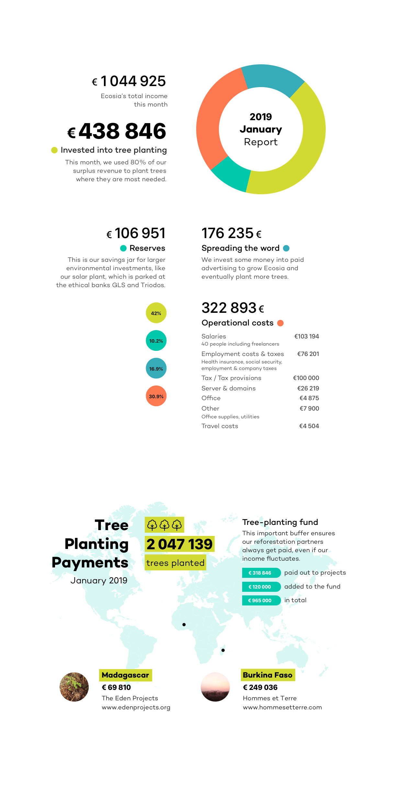
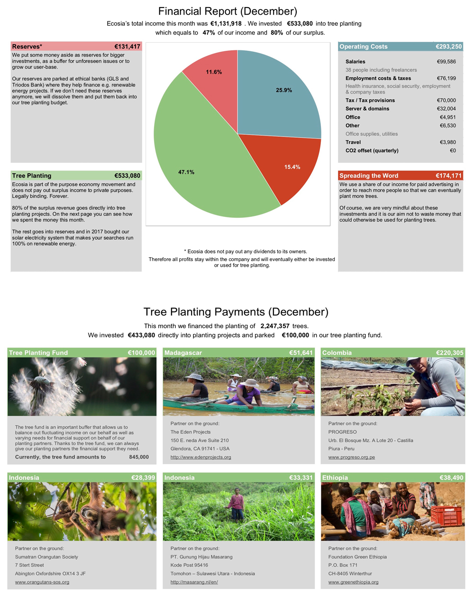

```{r setup, include=FALSE}
knitr::opts_chunk$set(echo = TRUE)
```

This markdown document is for trying out _Optical Character Recognition_ `R` 
using the [`tesseract`](https://ropensci.org/blog/2016/11/16/tesseract/) 
package.

## Libraries

```{r library, message = FALSE}
library(tidyverse)
library(tesseract)
```

# 1. Financial report from January 2019

Download the financial report from January 2019 (once).

```{r download_jan_2019, eval = FALSE}
download.file("https://blog.ecosia.org/content/images/2019/04/Financial-Report-January-2019-ecosia-.jpg",
              destfile = "images/2019_Jan.jpg", mode = "wb")
```



I want to extract the data from this image into tibbles, first I'm going to try
and use the `ocr` and `ocr_data` functions from the `tesseract` package.

```{r ocr}
jan_ocr <- ocr("images/2019_Jan.jpg")

jan_ocr_table <- ocr_data("images/2019_Jan.jpg")

```

I will try `magick` package and compare _OCR_ using this package with `tesseract`.

```{r magick, echo = FALSE}
library(magick)
```

```{r 2019_mag}
jan_2019_mag <- image_read("https://blog.ecosia.org/content/images/2019/04/Financial-Report-January-2019-ecosia-.jpg")

jan_2019_mag_ocr <- image_ocr(jan_2019_mag)

jan_ocr == jan_2019_mag_ocr

cat(jan_2019_mag_ocr)
```

It's definetly not perfect, and since there is only one financial report from 
2019 so far, it is probably better to start with the format used for 2018.

```{r}
jan_2019_grey <- image_quantize(image_read("images/2019_Jan.jpg"), colorspace = "gray")
jan_2019_grey

cat(image_ocr(jan_2019_grey))
```

```{r text_jan, eval = FALSE}
cat(image_ocr(jan_2019_grey), file = "text_files/Jan_2019_text.txt")
```

Grey scale is definetly better than color for _OCR_.

```{r}
jan_2019_bw <- image_convert(image_read("images/2019_Jan.jpg"), type = "Bilevel")
jan_2019_bw

image_negate(jan_2019_bw)

jan_2019_neg <- image_negate(image_read("images/2019_Jan.jpg"))
jan_2019_neg
cat(image_ocr(jan_2019_neg))

cat(image_ocr(image_quantize(jan_2019_neg, colorspace = "gray")))
```

Without doubt, __gray scale__ is the best for _OCR_.

## 1.1 Extract data from text

```{r}
text <- read_lines(image_ocr(jan_2019_grey))
text

text_jan <- text[str_detect(text, "[0-9]|Burkina Faso|Madagascar")]
text_jan


text_jan <- str_replace(text_jan, "€|¢", "")
text_jan <- text_jan[c(1, 3, 6, 7:16, 18:length(text_jan))]
text_jan


```


## 1.2 Web scraping

Since there is some data available at the respective blog post as well, web 
scraping is also an alternative to get additional data.


# 2. December 2018

```{r dec_2018_dl, eval = FALSE}
download.file("https://blog.ecosia.org/content/images/2019/02/ecosia_financial_report_december_2018_EN.jpg",
              "images/2018_Dec.jpg", mode = "wb")
```



```{r}
dec_2018 <- image_read("images/2018_Dec.jpg")

image_ocr(dec_2018)
dec_2018_table <- image_ocr_data(dec_2018)
cat(image_ocr(dec_2018))
```

It's not perfect, but the 2018 format is definetly better than the 2019 format 
for _OCR_. But I think it is possible to extract the most essential data from
2018 at least.

It is probably worth to try out _OCR_ methods using python as well! Python is 
also better for strings! 

After reading up on _OCR_, I learnt that gray and black and white images are 
easier for the software to extract characters from


### Grey colorspace
```{r}
dec_2018_grey <- image_quantize(dec_2018, colorspace = "gray")
dec_2018_grey

cat(image_ocr(dec_2018_grey))
```

### Black and white colorspace

```{r}
dec_2018_bw <- image_convert(dec_2018, type = "Bilevel")
dec_2018_bw

cat(image_ocr(dec_2018_bw))

dec_2018_grey_bw <- image_convert(dec_2018_grey, type = "Bilevel")

cat(image_ocr(dec_2018_grey_bw))
```


```{r}
dec_2018_table %>%
  filter(str_detect(word, "[0-9]"))

```


```{r}
```

